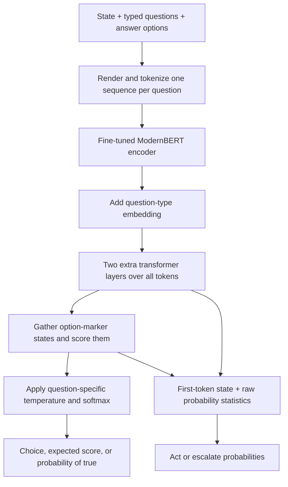

# Bringing Laya to Mac, mobile, and the browser

Investigated 19 September 2026. This report distinguishes inspected source/artifacts, measurements on this Mac, and proposed engineering work. The detailed runtime sources are in [runtime-options.md](runtime-options.md).

## Recommendation

**Yes: Apple GPU execution is already supported through PyTorch MPS. A Python-free Mac release is feasible, and browser/Android deployment is a credible next project.** A production port is more than changing a weight format: it must reproduce Laya's custom computation, tokenizer, question formatting, and probability calculation.

For the broadest useful public release, start with a reproducible **ONNX export plus a faithful prediction library**, then validate browser WASM/WebGPU and native runtimes. For a specifically Apple-native product, compare **Core ML and MLX** against the measured MPS baseline. A **ggml-based `laya.cpp`** is a reasonable project if a compact C/C++ library is the main goal: current llama.cpp already implements the ModernBERT backbone. It is more implementation work than a successful graph export, and has no demonstrated speed advantage for Laya yet.

The useful public contribution would be a tested, easy-to-install runtime with correct outputs, benchmarks, and reproducible conversion—not just another weight upload.

## What this model actually does

The local source checkout is [`upstream/laya`](../upstream/laya), from [NandhaKishorM/laya](https://github.com/NandhaKishorM/laya), pinned at `6a5819129eb220570792e417e49723d697efd76f`. The inspected Hugging Face checkpoint revision is `c5d78730f3493e4fe16d61507ef4b78eef7318cf`. Cached weights were reused; the source checkout does not contain model weights.

The English model has 421,293,827 trainable parameters plus a three-element temperature buffer. Direct inspection of the Safetensors header gives:

| Component | Parameters |
|---|---:|
| Fine-tuned ModernBERT encoder | 394,781,696 |
| Two extra transformer layers | 25,192,448 |
| Option scorer | 1,052,673 |
| Action head | 263,938 |
| Question-type embedding | 3,072 |

The checkpoint uses FP16 weights and an FP32 buffer: **842,609,210 bytes** on disk, about 843 MB decimal. The upstream loader constructs FP32 modules and copies weights into them, so its CPU/MPS model parameters occupy approximately 1.69 GB before activations and other allocations. A compact source file does not imply compact runtime memory. Evidence: [saved Hub metadata](sources/laya-metadata.json), [model construction](../upstream/laya/laya/common.py), [loading](../upstream/laya/laya/agent.py).



This is not an autoregressive language model. It evaluates supplied options, without generating a sequence of answer tokens. Three questions mean three differently formatted encoder sequences processed as a batch; the state is not encoded once and reused for free. Bidirectional attention lets question/options/state interact throughout the encoder. Arbitrarily caching the state encoding would change this architecture.

The source implements `choice` as a categorical distribution, `score` as the expected index on an ordinal rubric, and `noul` as a false/true distribution. For the root checkpoint, the input budget is 512 tokens per question, including instructions, options, and state. The encoder's larger position capacity does not establish Laya quality at longer lengths. [Pinned common.py](https://github.com/NandhaKishorM/laya/blob/6a5819129eb220570792e417e49723d697efd76f/laya/common.py)

## Python, Torch, and actual performance

Python orchestrates the calls; expensive matrix operations run in compiled kernels. PyTorch MPS executes them through Apple's Metal infrastructure. Replacing Python with C++ can improve packaging, dispatch overhead, and integration, but does not automatically improve the arithmetic kernels. Precision, graph fusion, tensor layout, attention implementation, device synchronization, input length, and keeping the model loaded can matter much more. [PyTorch MPS documentation](https://docs.pytorch.org/docs/stable/notes/mps.html)

Laya 0.3.3 explicitly selects CUDA, then MPS, then CPU. On this source revision, MPS uses FP32 and does not enable the CUDA autocast path. You can explicitly request the GPU with:

```python
agent = laya.load("convaiinnovations/laya", device="mps")
print(agent.device)  # Confirm actual placement; upstream can fall back to CPU.
```

The actual measurements and outputs are in [mac-baseline.json](mac-baseline.json), generated by [benchmark.py](../benchmark.py). The machine is an Apple M4 Pro MacBook Pro, 24 GB memory, macOS 15.8. The benchmark uses the original example, one or three questions, five warmups, twenty samples per measurement, and explicit GPU synchronization. It records forward-only and complete `predict` latency separately, in FP32. This is a small warm-latency baseline, not an accuracy evaluation, mobile benchmark, thermal test, or comparison against a converted runtime.

| Device | Questions per call | Forward p50 | Complete predict p50 | Complete predict p95 |
|---|---:|---:|---:|---:|
| CPU | 1 | 82.7 ms | 81.4 ms | 83.1 ms |
| Apple GPU / MPS | 1 | 21.8 ms | 23.3 ms | 23.9 ms |
| CPU | 3 | 149.3 ms | 151.6 ms | 159.2 ms |
| Apple GPU / MPS | 3 | 40.0 ms | 42.2 ms | 43.5 ms |

The complete GPU calls were approximately 3.5–3.6 times faster for this short input (padded sequence length 63). The CPU and GPU returned identical answer objects at the upstream API's four-decimal precision for these examples; this is not broad numerical parity evidence. Most measured time was in the forward pass. Single observed model loads took 23.4 seconds on CPU and 21.9 seconds on MPS, excluding downloads, so process startup should not be repeated for each decision. Those load times are not statistically characterized cold-start measurements.

Do not infer a universal speedup from the difference between separately measured medians. Forward-only and complete calls are independent timed samples. A native implementation still needs measurement on the same inputs. The upstream T4 timings are also not Mac measurements.

## Formats and runtimes: how they fit together

| Name | Its role | Implication for Laya |
|---|---|---|
| Safetensors | Stores named numerical arrays | Already used; architecture code is still required |
| GGUF | Stores weights and model metadata | Needs a runtime that understands the Laya graph |
| ggml | C/C++ tensor engine and backends | Foundation for a possible `laya.cpp` |
| llama.cpp | Model implementations using ggml | ModernBERT exists; full Laya does not follow automatically |
| ONNX | Stores the tensor computation graph and weights | Strong sharing point for desktop, mobile, and browser |
| ONNX Runtime | Executes ONNX using different backends | Each graph/backend combination must be validated |
| MLX | Array/model framework with Apple GPU support | Port model operations and weights; C++/Swift can ship without Python |
| Core ML | Apple's model format and native runtime | Convert the tensor graph; ship in an Apple application |
| WebAssembly | Browser CPU execution technology | Useful fallback, not GPU execution |
| WebGPU | Browser GPU compute API | An inference engine must translate graph operations into GPU work |

These distinctions are backed by the primary documentation linked in [runtime-options.md](runtime-options.md). Weight formats are not interchangeable promises of execution. Quantized files also encode particular numerical layouts and require matching kernels.

## Which route fits which goal?

| Goal | Recommended starting point | Remaining work |
|---|---|---|
| Run on this Mac GPU now | Existing PyTorch MPS | Confirm placement and measure real workloads |
| Easy Mac/iPhone application without Python | Core ML conversion; MLX as alternative | Conversion or implementation, tokenizer, Swift integration, parity |
| Portable native C/C++ library like whisper.cpp | ggml, reusing llama.cpp's ModernBERT work | Full custom head, converter, tokenization/API, backend validation |
| Run privately inside a browser | ONNX Runtime Web, WebGPU plus WASM fallback | Correct export, JavaScript prediction API, graph coverage, memory/performance testing |
| Native Android | ONNX Runtime first for graph reuse | CPU baseline, then device-specific acceleration and packaging |
| Torch-oriented native mobile deployment | ExecuTorch | Exportability and backend coverage testing |

MLX and Core ML are Apple deployment paths; they do not by themselves provide a browser or Android version. ONNX sharing helps, but one artifact may not be optimal everywhere. CPU INT8 and WebGPU weight-only quantization have different operator requirements. See the [runtime comparison](runtime-options.md) for official sources and exact caveats.

## The existing community ONNX export: useful, but incomplete for this example

Found [Mattepiu/laya-onnx](https://huggingface.co/Mattepiu/laya-onnx), pinned to `a7f385bd51d35f5cbeb88e8bc4f0c7e7c0f24c44`. I downloaded and parsed only the small FP32/FP16 graph files, without their large external weights. This was a graph inspection, not execution or numerical validation. [Metadata](sources/laya-onnx-metadata.json), [graph audit including SHA-256 hashes](sources/onnx-graph-audit.json).

| Artifact | Observed contract | Consequence |
|---|---|---|
| `laya.onnx` + external data | Dynamic batch/sequence, marker tensors `[batch, 2]`, logits `[batch, 2]`, extra action-like output declared `[1, 2]` | Fixed two-option interface; batch behavior of extra output needs validation |
| `fp16_onlygpu_unverified/laya_fp16.onnx` + external data | Same two-option marker interface; only logits output | No full action output; publisher explicitly labels folder unverified |
| `int8/laya_int8.onnx` | Listed at 581,105,897 bytes | Graph/weights not downloaded or audited; no WebGPU compatibility claim established |

The FP32 artifact totals about 1.689 GB; FP16 totals about 845.5 MB including graph. The existing FP32 graph contains `TopK`; the inspected ORT WebGPU operator table does not list it. The FP16 graph has removed that branch. Browser provider assignment and correctness still require execution; an operator list alone is not proof of compatibility. [ORT WebGPU operator table](https://github.com/microsoft/onnxruntime/blob/main/js/web/docs/webgpu-operators.md)

Your department and urgency questions each have three options, so the declared two-option graph interface is a direct mismatch. The README's example also uses abbreviated true/false options and softmaxes raw logits without the upstream per-question temperature. It should not be treated as a faithful replacement for `laya.predict`. The repository file list has no `rl_agent_config.json`; calibration metadata would need to accompany a release. [Community model card](https://huggingface.co/Mattepiu/laya-onnx), [upstream postprocessing](https://github.com/NandhaKishorM/laya/blob/6a5819129eb220570792e417e49723d697efd76f/laya/agent.py)

## Porting details that must stay exact

1. Use Laya's fine-tuned encoder weights, not untouched ModernBERT weights.
2. Match JSON serialization, insertion order, tokenizer IDs, leading spaces, marker sanitization, option descriptions, and truncation. In JavaScript, default `JSON.stringify` whitespace differs from Python's default `json.dumps`; textual equivalence is insufficient if token IDs change.
3. Preserve the encoder's alternating global/local bidirectional attention and corresponding RoPE settings.
4. Add the type embedding and run both extra head layers on the entire sequence before gathering markers. Those head layers use **ReLU**; the scorer/action MLPs use **GELU**. They are not another pair of ModernBERT layers.
5. Preserve masked options and calibrated temperature selection, including option-count buckets. Choice/score confidence is entropy-based; `noul` confidence is the larger boolean probability. Confidence is not universally the top softmax value.
6. The action branch uses statistics from **uncalibrated** option logits plus the first-token vector. Applying the final temperature before constructing those features changes it.

All six follow from the pinned [common.py](../upstream/laya/laya/common.py) and [agent.py](../upstream/laya/laya/agent.py). A correct release compares token IDs, intermediate states, raw logits, final probabilities, expected scores, and action outputs—not only the final label on one example.

## A concrete public-release sequence

**First milestone: a faithful portable floating-point model.** Export a tensor-only wrapper with inputs `input_ids`, `attention_mask`, `marker_pos`, `marker_mask`, and `qtype`. Support variable option counts or explicitly documented option buckets; validate mixed question types and batches. Retain both option logits and action output, or explicitly define a smaller API. Start with conservative fixed shape buckets if export/backends need them. Keep the calibrated API logic outside the graph initially.

**Second milestone: a browser library and a native baseline.** Port preprocessing/postprocessing to TypeScript with golden fixtures from upstream. Run ORT CPU/WASM first for correctness, then WebGPU. Check actual provider placement. If the action branch prevents efficient WebGPU execution, investigate moving only its small computation to CPU or rewriting unsupported operations. Avoid transfers in every encoder layer. Implement weight caching, progress, capability detection, and a worker to keep the page responsive. Measure cold download/init separately from warm inference.

**Third milestone: precision and size.** Establish floating-point parity before quantization. Compare FP16, backend-supported INT8, and weight-only 4-bit selectively. Ideal all-weight payloads are about 843/421/211 MB respectively, before scales, metadata, mixed precision, and runtime buffers. The published INT8 artifact is already larger than the ideal because ideal bit arithmetic is not an actual packaging result. Browser/mobile peak memory, power, and download size may matter more than a few milliseconds.

**Fourth milestone: choose the native product.** If Apple integration is the priority, compare direct Core ML and MLX to MPS on the same workload. If the desired product is `laya.cpp`, reuse the existing ModernBERT implementation and add a properly defined Laya graph/GGUF conversion. Keep only routes with a demonstrated product or performance benefit.

A release should include pinned source/model revisions, model checksums, converter source, license/attribution, supported shapes and devices, tokenizer/config/calibration data, parity fixtures, a small CLI or SDK, and published measurements. Python can remain a conversion/development dependency without becoming an end-user dependency.

## Model quality and redistribution

Performance portability and task suitability are separate. The current upstream card explicitly reports weak zero-shot results on its typed-decisions benchmark and overconfidence; it distinguishes English, multilingual, and task-specialized checkpoints. A correct port preserves the model's behavior, including its limitations. Evaluate held-out examples from the actual task and measure probability drift/calibration after quantization. Do not infer guaranteed calibration from the training objective. [Upstream model card](https://huggingface.co/convaiinnovations/laya)

Laya's code and published weights are presented under Apache 2.0, as is the ModernBERT base model. That permits a public derivative subject to the license conditions. Include the license, retain applicable attribution/notices, identify modifications, and carry any required NOTICE content; audit runtime/tokenizer dependency licenses as part of packaging. This research has not published anything. [Laya license](https://github.com/NandhaKishorM/laya/blob/6a5819129eb220570792e417e49723d697efd76f/LICENSE), [ModernBERT card](https://huggingface.co/answerdotai/ModernBERT-large), [Apache 2.0 conditions](https://www.apache.org/licenses/LICENSE-2.0)
